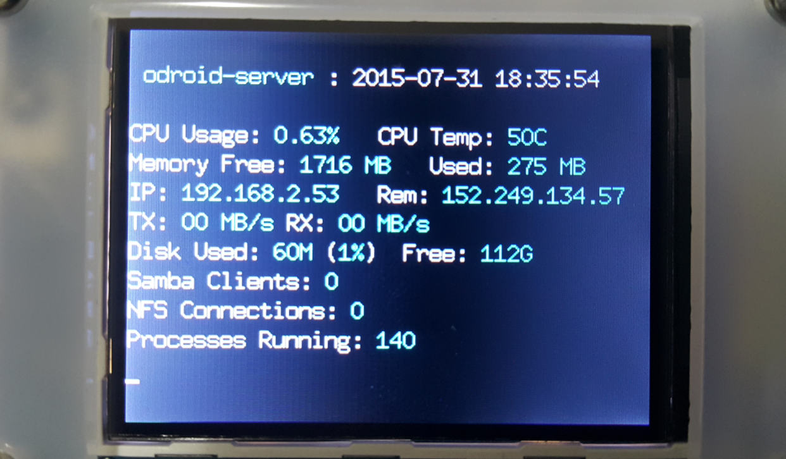

# cloudshell_lcd
ODROID-XU4 Cloudshell LCD Informations for Server

## Overview

A fork from the original repo for archlinux.

## Install
    wget https://raw.githubusercontent.com/skilbjo/cloudshell-archlinux/master/src/cloudshell

    sudo ./cloudshell

## Arch Linux changes
Differences from original package:
  - additional dependency: `bc`
  - removed font not on vanilla archlinux
  - LAN IP not working
  - added service to start at bootup (rather than a manual start of the script)

Fix LAN IP
Fix disk used, Fix Free

Nice to haves
CPU usage could be left padded.
Could be aligned
